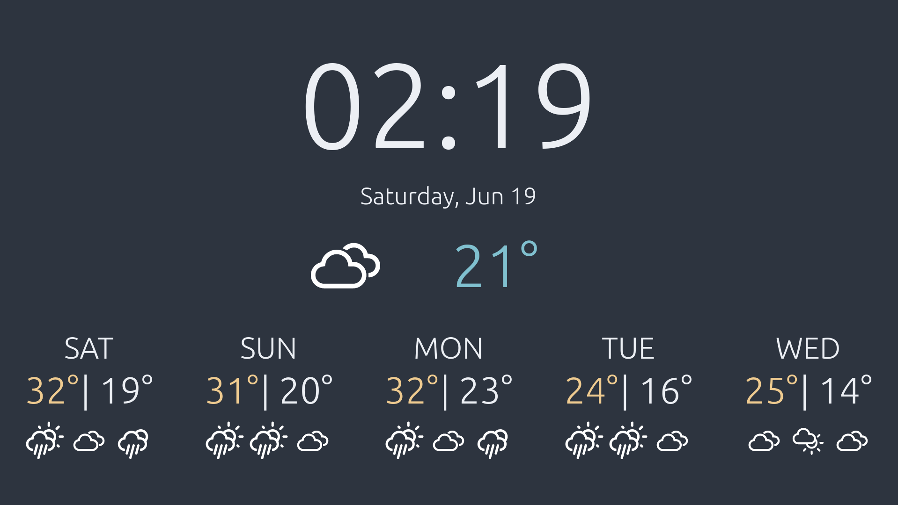

# weatherdash
Weather dashboard with date and time.




# Setup
To use locally, create weatherdash/local_settings.py (same location
as weatherdash/settings.py) with the following:
```python
from django.core.management.utils import get_random_secret_key

SECRET_KEY = get_random_secret_key()
ALLOWED_HOSTS = ["localhost", "127.0.0.1", "0.0.0.0"]
CITY = ""                      # e.g. "New York City"
STATE_CODE = ""                # e.g. "NY"
COUNTRY_CODE = ""              # e.g. "US"
UNIT = ""                      # e.g. "metric" or "imperial"
OPEN_WEATHER_MAP_API_KEY = ""  # get this from https://openweathermap.org/

```

Migrate over settings once.
```terminal
python manage.py migrate
```

Then run the server.
```terminal
python manage.py runserver 127.0.0.1:8000
```
